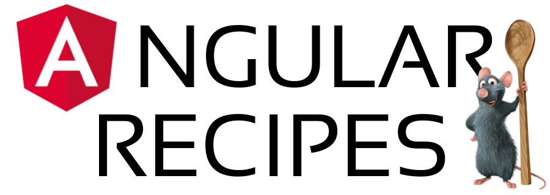

  

<h3 align="center" style="font-style: italic;">"A recipe is a story that ends with a good meal code"</h3>

> Interested in contributing or just seeing it in action? Head over to [CONTRIBUTING.md](CONTRIBUTING.md) to learn how to spin up the project!

## Why?

**Angular Recipes** è la mia raccolta di *\"ricette\"* per lo sviluppo di applicazioni [Angular](https://angular.io/) e preciso che, in quanto tale, è *un* ricettario, non *il* ricettario. Si tratta infatti di una raccolta di consigli, metodologie e link ad articoli utili, ma esistono pur sempre innumerevoli modi di fare le cose, migliori o peggiori a seconda del contesto. Questa raccolta costituisce, insomma, un punto di partenza, e non uno d'arrivo, verso la stesura di un codice pulito, scalabile e facile da manutenere.

## Features

## Getting Started

Check out the [Quick Start](quick-start) documentation to get started.

## Credits

_In ordine alfabetico:_

- [Geremia Nappo]() - Creator / Maintainer

## Contributors

[//]: contributor-faces

[//]: contributor-faces
